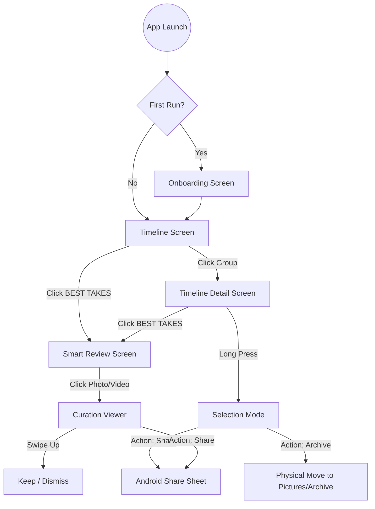

# MemoryCurator Project Reference

This document serves as a reference for the project structure and navigation flow to maintain context and ensure clean code practices.

## 1. Project Map (Structural Reference)

| Layer | Path | Responsibility |
| :--- | :--- | :--- |
| **Data (Local)** | `app/src/main/java/com/memorycurator/app/data/local/MediaEntity.kt` | Room entity with AI metadata, `isArchived`, `dateModified`, and `originalFolderName`. |
| | `app/src/main/java/com/memorycurator/app/data/local/MediaDao.kt` | Queries for timeline, albums, and metadata transfers for moves (Archive/Restore). |
| **Data (Media)** | `app/src/main/java/com/memorycurator/app/data/media/MediaPhoto.kt` | Core domain model for images/videos with `isVideo` and `dateModified` versioning. |
| | `app/src/main/java/com/memorycurator/app/data/media/MediaRepositoryImpl.kt` | Handles Paging and **Physical File Lifecycle** (Stream-based Archive/Restore and MediaStore Sync). |
| | `app/src/main/java/com/memorycurator/app/data/media/MediaIndexer.kt` | Manages background indexing: Full scans + **Incremental URI-based updates** via Observer. |
| **Core (AI)** | `app/src/main/java/com/memorycurator/app/core/ai/ImageCurator.kt` | Orchestrates face detection, labeling, and scoring pipelines. |
| | `app/src/main/java/com/memorycurator/app/core/ai/AestheticScorer.kt` | Composition (Rule of Thirds), Color Harmony, and Lighting analysis. |
| | `app/src/main/java/com/memorycurator/app/core/ai/ImageAnalysis.kt` | Data model for holding inference results (scores, labels). |
| **Video Processing**| `:video-processor` (Module) | Independent module for heavy video/audio AI tasks. |
| | `.../video_processor/VideoAnalyzer.kt` | Main orchestrator for video/audio AI pipeline. |
| | `.../video_processor/AudioNoiseReducer.kt`| LiteRT-based audio denoising (Decoding -> AI -> Encoding). |
| | `.../video_processor/AudioTranscriber.kt` | Speech-to-Text conversion (Generates .txt files). |
| **UI (Screens)** | `app/src/main/java/com/memorycurator/app/feature/gallery/ui/GalleryScreen.kt` | Main grid view with mixed media support and play badges. |
| | `app/src/main/java/com/memorycurator/app/feature/timeline/ui/TimelineScreen.kt` | Grouped media view with dynamic item counting. |
| | `app/src/main/java/com/memorycurator/app/feature/timeline/ui/TimelineDetailScreen.kt` | Detail view with **Bulk Selection**, Share actions, and AI section toggles. |
| | `app/src/main/java/com/memorycurator/app/ui/screens/AICurationScreen.kt` | "Smart Review" screen with Keepers, Review, and carousel gestures. |
| **UI Components** | `app/src/main/java/com/memorycurator/app/ui/components/VideoPlayer.kt` | Media3-based player with playback controls. |
| | `app/src/main/java/com/memorycurator/app/ui/screens/CurationViewerScreen.kt` | Specialized viewer for AI results with cluster navigation and "Swipe to Act" gestures. |

---

## 2. Site Map (Navigation Reference)

---

## 3. Development Guidelines

1.  **AI Persistence**: Always check `MediaEntity` for existing `aiScore` before running inference.
2.  **Physical Integrity**: Archive/Restore must use the **Stream Copy + Delete** method to ensure visibility across system apps and avoid permission crashes on Android 11+.
3.  **Real-time Sync**: Use the `ContentObserver` for incremental updates. Do not trigger full re-scans for single file changes.
4.  **Cache Invalidation**: Always pass `dateModified` as a parameter to Coil `ImageRequest` to prevent showing old/wrong cached thumbnails.
5.  **Android 15 Compatibility**: Avoid querying `MediaStore.Files` with the `IS_TRASHED` column; query specialized media tables if status tracking is needed.
6.  **Visual Language**: Use `SectionHeaderSmall` for curation categories and maintain the "Glass" aesthetic for all overlays.
7.  **Data Safety**: When moving files (which changes their system ID), use `transferMetadata` in `MediaDao` to migrate AI scores to the new record.
