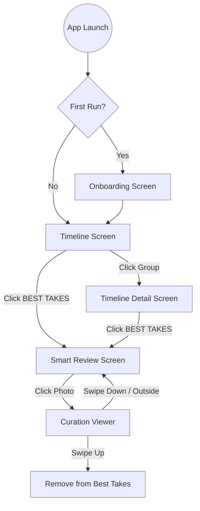

# MemoryCurator Project Reference

This document serves as a reference for the project structure and navigation flow to maintain context and ensure clean code practices.

## 1. Project Map (Structural Reference)

| Layer | Path | Responsibility |
| :--- | :--- | :--- |
| **Data (Local)** | `app/src/main/java/com/memorycurator/app/data/local/MediaEntity.kt` | Room entity with AI metadata (isBestTake, score, etc). |
| | `app/src/main/java/com/memorycurator/app/data/local/MediaDao.kt` | Queries for timeline, albums, and AI status updates. |
| **Data (Media)** | `app/src/main/java/com/memorycurator/app/data/media/MediaPhoto.kt` | Core domain model for a single image. |
| | `app/src/main/java/com/memorycurator/app/data/media/MediaRepository.kt` | Interface for Paging, DB updates, and AI results persistence. |
| **Core (AI)** | `app/src/main/java/com/memorycurator/app/core/ai/ImageCurator.kt` | Real on-device AI logic (ML Kit: Face + Labeling + Clustering). |
| **UI (Screens)** | `app/src/main/java/com/memorycurator/app/ui/screens/AICurationScreen.kt` | "Smart Review" screen with Keepers, Review, and Carousels. |
| | `app/src/main/java/com/memorycurator/app/ui/screens/AICurationViewModel.kt` | Manages AI lifecycle, DB caching, and manual overrides. |
| | `app/src/main/java/com/memorycurator/app/ui/screens/OnboardingScreen.kt` | AI Expectation management for first-time users. |
| **Navigation** | `app/src/main/java/com/memorycurator/app/ui/navigation/MainNavigation.kt` | Orchestrates routing between Timeline, Albums, and Smart Review. |

---

## 2. Site Map (Navigation Reference)

---

## 3. Development Guidelines

1.  **AI Persistence**: Always check `MediaEntity` for existing `aiScore` before running inference.
2.  **Explicit Control**: Never delete/modify without user confirmation or explicit gesture.
3.  **Visual Feedback**: Actions like "Remove from Best Takes" must have clear, intent-aligned animations (e.g., Red flash/tint).
4.  **Hardware Efficiency**: Use `Dispatchers.Default` for AI and `Dispatchers.IO` for DB to prevent UI jank.
