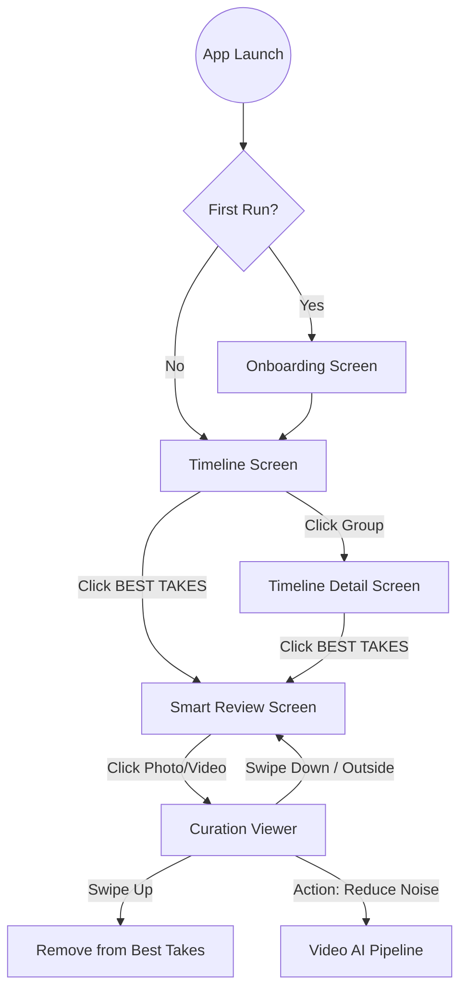

# MemoryCurator Project Reference

This document serves as a reference for the project structure and navigation flow to maintain context and ensure clean code practices.

## 1. Project Map (Structural Reference)

| Layer | Path | Responsibility |
| :--- | :--- | :--- |
| **Data (Local)** | `app/src/main/java/com/memorycurator/app/data/local/MediaEntity.kt` | Room entity with AI metadata (isBestTake, score, etc). |
| | `app/src/main/java/com/memorycurator/app/data/local/MediaDao.kt` | Queries for timeline, albums, and AI status updates. |
| **Data (Media)** | `app/src/main/java/com/memorycurator/app/data/media/MediaPhoto.kt` | Core domain model for images/videos with `isVideo` flag. |
| | `app/src/main/java/com/memorycurator/app/data/media/MediaRepository.kt` | Interface for Paging, DB updates, and AI results persistence. |
| | `app/src/main/java/com/memorycurator/app/data/media/MediaIndexer.kt` | Indexes both Images and Videos from MediaStore into Local DB. |
| **Core (AI)** | `app/src/main/java/com/memorycurator/app/core/ai/ImageCurator.kt` | Real on-device AI logic (ML Kit: Face + Labeling + Clustering). |
| **Video Processing**| `:video-processor` (Module) | Independent module for heavy video/audio AI tasks. |
| | `.../video_processor/VideoAnalyzer.kt` | Main orchestrator for video/audio AI pipeline. |
| | `.../video_processor/AudioNoiseReducer.kt`| LiteRT-based audio denoising (Decoding -> AI -> Encoding). |
| | `.../video_processor/AudioTranscriber.kt` | Speech-to-Text conversion (Generates .txt files). |
| | `.../video_processor/VideoFrameAnalyzer.kt`| Samples frames (2-3 FPS) for visual quality AI review. |
| **UI (Screens)** | `app/src/main/java/com/memorycurator/app/feature/gallery/ui/GalleryScreen.kt` | Main grid view with mixed media support and play badges. |
| | `app/src/main/java/com/memorycurator/app/feature/timeline/ui/TimelineScreen.kt` | Grouped media view with dynamic item counting. |
| | `app/src/main/java/com/memorycurator/app/feature/viewer/ui/ViewerScreen.kt` | Media viewer with integrated `VideoPlayer` and AI actions. |
| | `app/src/main/java/com/memorycurator/app/ui/screens/AICurationScreen.kt` | "Smart Review" screen with Keepers, Review, and Carousels. |
| **UI Components** | `app/src/main/java/com/memorycurator/app/ui/components/VideoPlayer.kt` | Media3-based player with playback controls. |
| **Navigation** | `app/src/main/java/com/memorycurator/app/ui/navigation/MainNavigation.kt` | Orchestrates routing between Timeline, Albums, and Smart Review. |

---

## 2. Site Map (Navigation Reference)

---

## 3. Development Guidelines

1.  **AI Persistence**: Always check `MediaEntity` for existing `aiScore` before running inference.
2.  **Explicit Control**: Never delete/modify without user confirmation or explicit gesture.
3.  **Video Support**: Use `CoilConfig` with `VideoFrameDecoder` for thumbnails and `VideoPlayer` for playback.
4.  **16 KB Compatibility**: Use **LiteRT** (not legacy TFLite) and maintain `useLegacyPackaging = true` in Gradle.
5.  **Performance**: Run 2-3 FPS sampling for video analysis to avoid OOM on mobile hardware.
