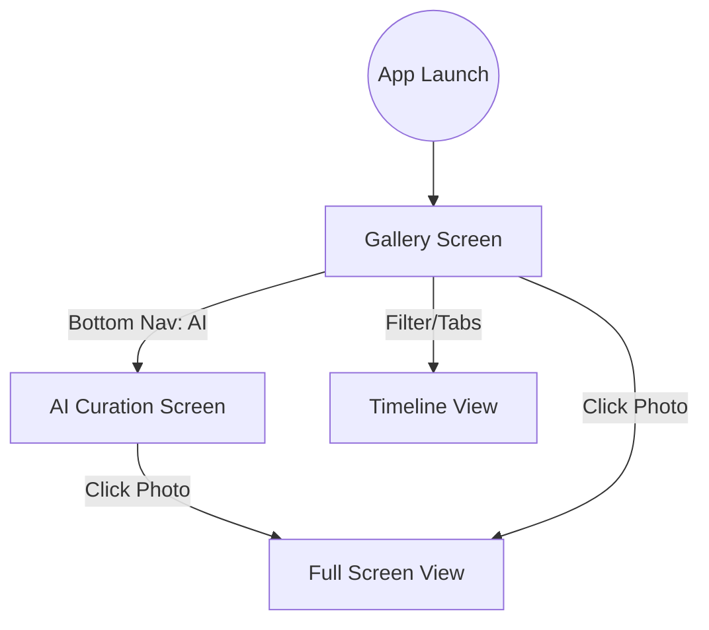

# MemoryCurator Project Reference

This document serves as a reference for the project structure and navigation flow to maintain context and ensure clean code practices.

## 1. Project Map (Structural Reference)

| Layer | Path | Responsibility |
| :--- | :--- | :--- |
| **Data** | `app/src/main/java/com/memorycurator/app/data/media/MediaPhoto.kt` | Core domain model for a single image. |
| | `app/src/main/java/com/memorycurator/app/data/media/MediaRepository.kt` | Interface defining how we fetch media. |
| | `app/src/main/java/com/memorycurator/app/data/media/MediaRepositoryImpl.kt` | Logic for querying `MediaStore` (Internal Storage). |
| | `app/src/main/java/com/memorycurator/app/data/media/MediaPagingSource.kt` | Logic for lazy-loading photos (Paging 3). |
| **Core (AI)** | `app/src/main/java/com/memorycurator/app/core/ai/ImageCurator.kt` | Interface & Logic for AI image filtering. |
| | `app/src/main/java/com/memorycurator/app/core/ai/ImageAnalysis.kt` | Data model for AI results (scores, labels). |
| **UI (Models)** | `app/src/main/java/com/memorycurator/app/ui/models/PhotoItem.kt` | Presentation model used specifically for UI components. |
| **UI (Common)** | `app/src/main/java/com/memorycurator/app/ui/components/` | Reusable Glassmorphism UI elements (Cards, Bars). |
| **UI (Screens)** | `app/src/main/java/com/memorycurator/app/ui/gallery/` | Main gallery logic (Grid view of all photos). |
| | `app/src/main/java/com/memorycurator/app/ui/screens/AICurationScreen.kt` | Screen displaying AI-selected "best" photos. |
| | `app/src/main/java/com/memorycurator/app/ui/screens/AICurationViewModel.kt` | Orchestrates AI analysis and UI state. |
| **Navigation** | `app/src/main/java/com/memorycurator/app/ui/navigation/MainNavigation.kt` | Single source of truth for app routing. |

---

## 2. Site Map (Navigation Reference)

---

## 3. Development Guidelines

1.  **Scope Locking**: Only modify files relevant to the current task.
2.  **Separation of Concerns**: Keep AI logic in `core/ai`, data logic in `data`, and UI logic in `ui`.
3.  **Clean Code**: Ensure every line is understandable and serves a specific purpose in the architecture.
4.  **Context Maintenance**: Refer to this file at the start of every session to avoid "lost in the middle" issues.
