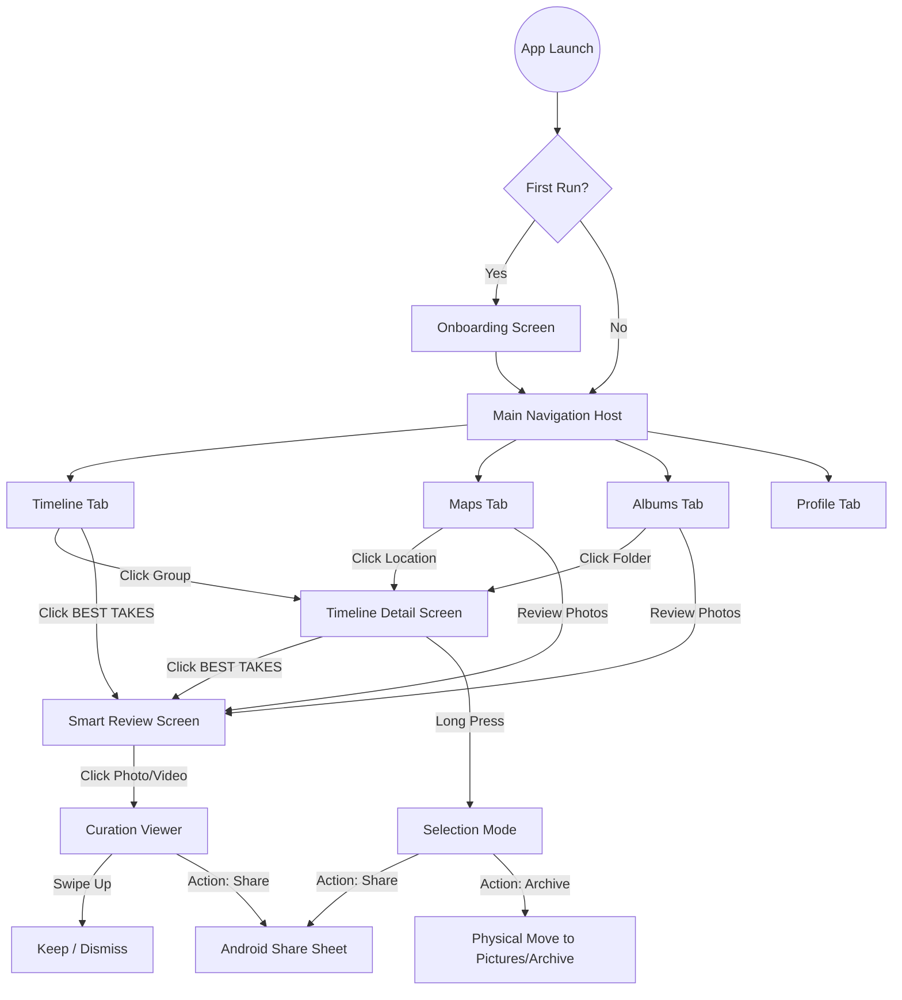

# MemoryCurator Project Reference

This document serves as a reference for the project structure and navigation flow to maintain context and ensure clean code practices.

## 1. Project Map (Structural Reference)

| Layer | Path | Responsibility |
| :--- | :--- | :--- |
| **Data (Local)** | `app/src/main/java/com/memorycurator/app/data/local/MediaEntity.kt` | Room entity with AI metadata, `isArchived`, `dateModified`, and `originalFolderName`. |
| | `app/src/main/java/com/memorycurator/app/data/local/MediaDao.kt` | Queries for timeline, albums, and metadata transfers for moves (Archive/Restore). |
| | `app/src/main/java/com/memorycurator/app/data/local/AlbumProjection.kt` | Specialized projections for folder-based and location-based media grouping. |
| **Data (Media)** | `app/src/main/java/com/memorycurator/app/data/media/MediaPhoto.kt` | Core domain model for images/videos with `isVideo` and `dateModified` versioning. |
| | `app/src/main/java/com/memorycurator/app/data/media/MediaRepositoryImpl.kt` | Handles Paging and **Physical File Lifecycle** (Stream-based Archive/Restore and MediaStore Sync). |
| | `app/src/main/java/com/memorycurator/app/data/media/MediaIndexer.kt` | Manages background indexing: **Chunk-based (500 items)** scans + Incremental updates. |
| | `app/src/main/java/com/memorycurator/app/data/media/ExifMetadataManager.kt` | Extraction of EXIF data including GPS location, orientation, and high-precision timestamps. |
| **Core (AI)** | `app/src/main/java/com/memorycurator/app/core/ai/ImageCurator.kt` | Orchestrates face detection, labeling, and scoring pipelines. |
| | `app/src/main/java/com/memorycurator/app/core/ai/AestheticScorer.kt` | Composition (Rule of Thirds), Color Harmony, and Lighting analysis. |
| | `app/src/main/java/com/memorycurator/app/core/ai/ImageAnalysis.kt` | Data model for holding inference results (scores, labels). |
| **Video Processing**| `:video-processor` (Module) | Independent module for heavy video/audio AI tasks. |
| | `.../video_processor/VideoAnalyzer.kt` | Main orchestrator for video/audio AI pipeline. |
| | `.../video_processor/VideoFrameAnalyzer.kt` | Samples and reviews video frames for visual quality, blur, and exposure. |
| | `.../video_processor/AudioCurator.kt` | Highlight identification and clipping using Media3 Transformer. |
| | `.../video_processor/AudioNoiseReducer.kt`| LiteRT-based audio denoising (Decoding -> AI -> Encoding). |
| | `.../video_processor/AudioTranscriber.kt` | Speech-to-Text conversion (Generates .txt files). |
| **UI (Screens)** | `app/src/main/java/com/memorycurator/app/feature/timeline/ui/TimelineScreen.kt` | Grouped media view by date. |
| | `app/src/main/java/com/memorycurator/app/feature/timeline/ui/TimelineDetailScreen.kt` | Shared detail view for Timeline, Albums, and Maps groups with **Bulk Selection**. |
| | `app/src/main/java/com/memorycurator/app/feature/gallery/ui/GalleryScreen.kt` | Main grid view with mixed media support and play badges. |
| | `app/src/main/java/com/memorycurator/app/feature/albums/ui/AlbumsScreen.kt` | Folder-based media navigation. |
| | `app/src/main/java/com/memorycurator/app/feature/maps/ui/MapsScreen.kt` | Location-based media navigation. |
| | `app/src/main/java/com/memorycurator/app/ui/screens/AICurationScreen.kt` | "Smart Review" screen with Keepers, Review, and carousel gestures. |
| **UI Navigation** | `app/src/main/java/com/memorycurator/app/ui/navigation/MainNavigation.kt` | Primary App Navigation Host managing bottom bar routes and back-stack logic. |
| **UI Components** | `app/src/main/java/com/memorycurator/app/ui/components/VideoPlayer.kt` | Media3-based player with playback controls. |
| | `app/src/main/java/com/memorycurator/app/ui/components/GlassSurface.kt` | Core component for the "Glass" morphism aesthetic. |
| | `app/src/main/java/com/memorycurator/app/ui/components/BlurBackground.kt` | Global dynamic background blur implementation. |

---

## 2. Site Map (Navigation Reference)

---

## 3. Development Guidelines

1.  **AI Persistence**: Always check `MediaEntity` for existing `aiScore` before running inference.
2.  **Physical Integrity**: Archive/Restore must use the **Stream Copy + Delete** method to ensure visibility across system apps. When moving files, use `transferMetadata` in `MediaDao` to migrate AI scores to the new system ID.
3.  **Real-time Sync**: Use the `ContentObserver` for incremental updates via `MediaIndexer`. Do not trigger full re-scans for single file changes.
4.  **Cache Invalidation**: Always pass `dateModified` as a parameter to Coil `ImageRequest` to prevent showing old/wrong cached thumbnails.
5.  **Visual Language**: All grouped media views should leverage the `TimelineDetailScreen` for consistency. Use `BlurBackground` in the main scaffold to support the `GlassSurface` components' aesthetic.
6.  **Modular Processing**: Heavy media analysis (frame sampling, audio transcription) must reside in the `:video-processor` module to keep the `:app` UI responsive.
7.  **Android Compatibility**: Ensure `ExifMetadataManager` handles various OEM-specific EXIF tags correctly for accurate location and time sorting.
